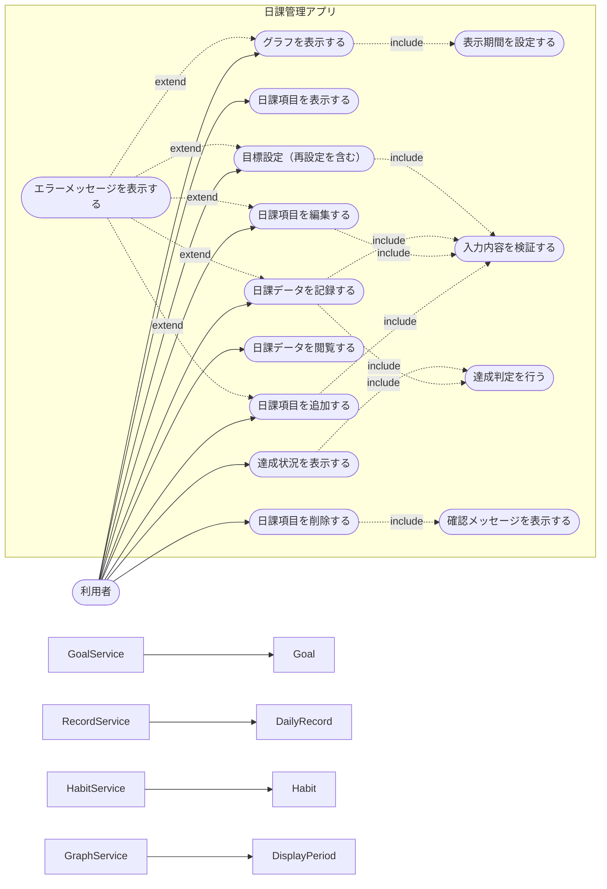
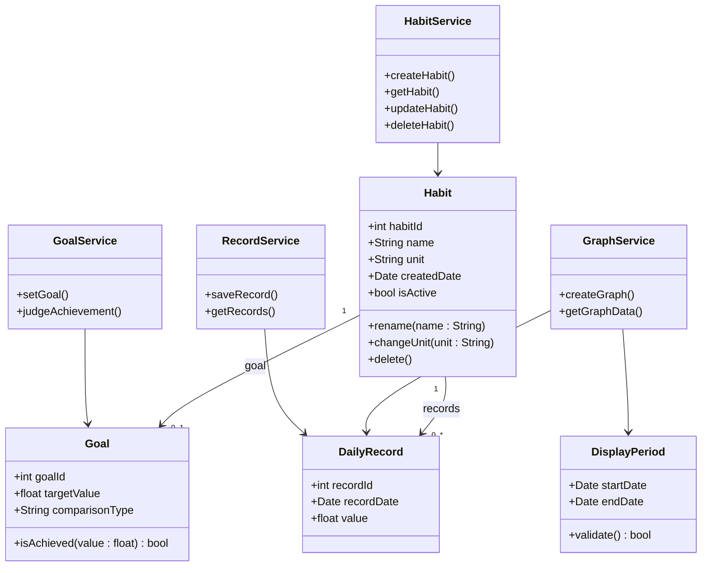
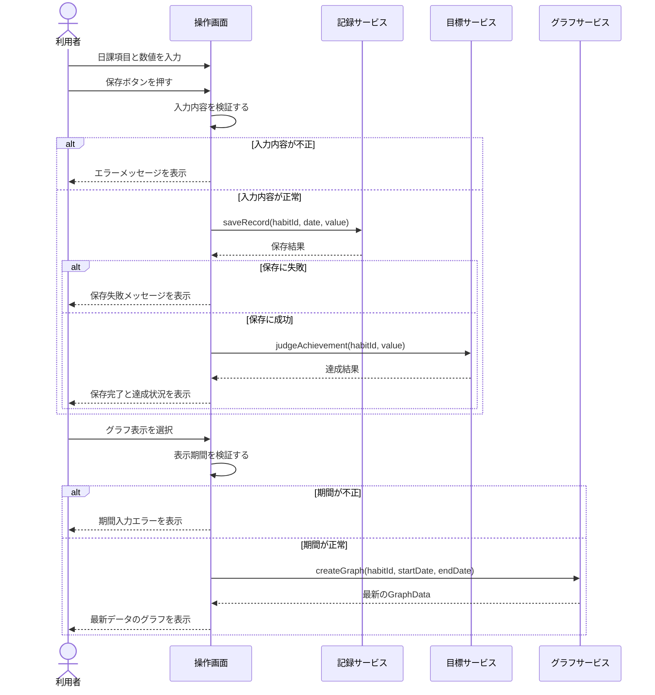
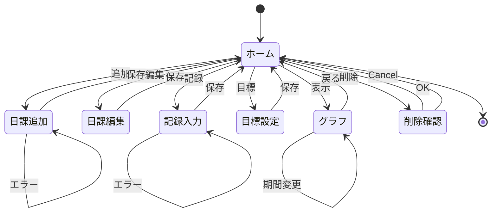

# 日課管理アプリ

Python、Tkinter、SQLite、Matplotlibで作成したデスクトップアプリです。

## 実装済み機能
- 日課項目の追加
- 日課項目の一覧表示
- 日課項目の編集
- 日課項目の削除
- 日々の数値記録
- 過去の記録表示
- 目標設定
- 同じ日課への目標再設定（上書き）
- 目標達成判定
- 期間指定グラフ
- グラフ表示時の最新データ自動読込
## 実装していない機能
- 記録の編集
- 目標の削除
- 他ユーザとの共有
## セットアップ
### 1. Pythonを確認
```bash
python --version
```
Windowsで上記が動かない場合：
```bash
py --version
```
### 2. 仮想環境を作成
```bash
python -m venv .venv
```
Windows PowerShell：
```powershell
.venv\Scripts\Activate.ps1
```
Windows コマンドプロンプト：
```cmd
.venv\Scripts\activate
```
### 3. ライブラリをインストール
```bash
pip install -r requirements.txt
```
### 4. 実行
```bash
python app.py
```
## 補足
- データは同じフォルダ内の `habit_tracker.db` に保存されます。
- `habit_tracker.db` を削除すると、すべての登録内容が初期化されます。




